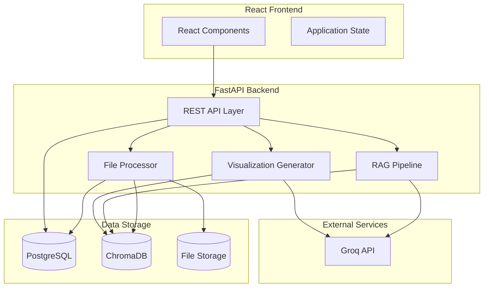
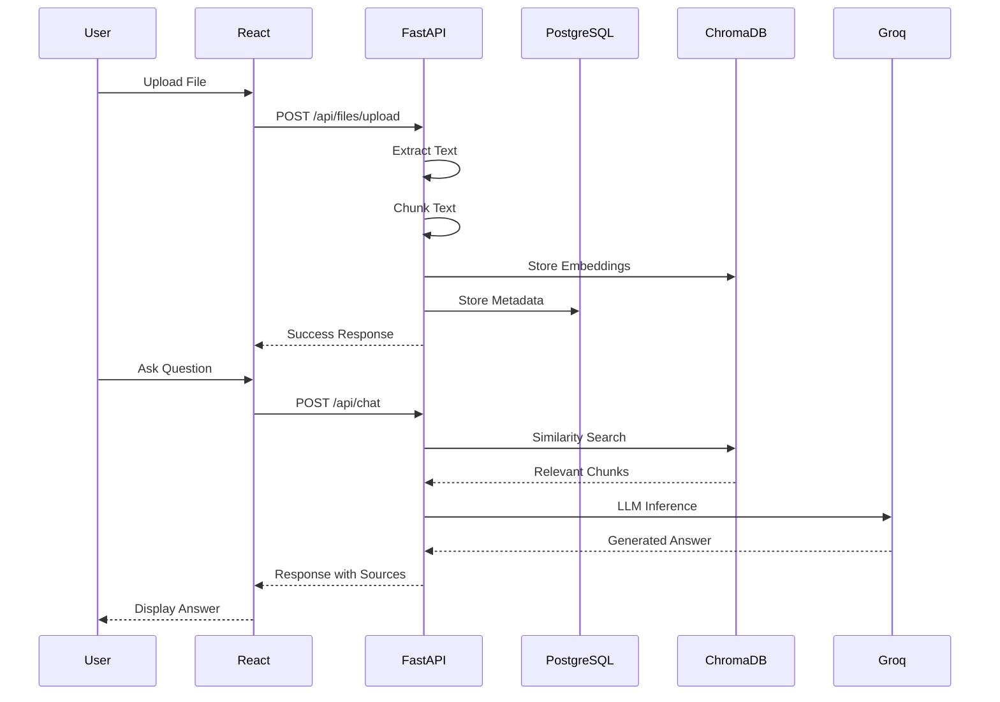

# Technical Design Document: Project Intelligence Hub

## Overview

The Project Intelligence Hub is a RAG-based (Retrieval-Augmented Generation) proof-of-concept application that enables users to create a single project, upload various file types, automatically process and index data into ChromaDB, and interact with the combined information through an AI-powered chatbot and visualization generator.

### Key Design Principles

1. **Simplicity First**: No authentication, no user management, no multi-project support — this is a lightweight POC
2. **Modular Architecture**: Clear separation between frontend, backend, and data processing components
3. **Single Project Model**: The entire application revolves around one active project at a time
4. **RAG Pipeline**: Combine vector search with LLM inference for intelligent question answering

### Technology Stack

| Layer | Technology | Purpose |
|-------|------------|---------|
| Frontend | React + TypeScript | User interface |
| UI Charts | Recharts | Data visualization |
| Backend | FastAPI (Python) | REST API server |
| Metadata DB | PostgreSQL | Project and file metadata storage |
| Vector DB | ChromaDB | Document embeddings and similarity search |
| LLM | Groq API | AI inference for chat and visualization |
| PDF Processing | PyMuPDF | PDF text extraction |
| Data Processing | pandas | Excel/CSV file processing |

## Architecture

### High-Level Architecture



### Request Flow Architecture



## Components and Interfaces

### Frontend Components

#### 1. App Router Component
- **Purpose**: Manages application routing and navigation state
- **Routes**:
  - `/` - Create Project Screen (when no project exists)
  - `/dashboard` - Dashboard Screen
  - `/data` - Data Management Screen
  - `/chat` - AI Chat Screen
  - `/visualize` - AI Visualization Screen

#### 2. CreateProjectScreen Component
- **Purpose**: Allows users to create a new project
- **State**: `projectName: string`, `description: string`, `error: string | null`
- **Behavior**: Redirects to Dashboard if project already exists

#### 3. DashboardScreen Component
- **Purpose**: Displays project overview and statistics
- **Data Requirements**:
  - Project name and description
  - Total file count
  - File distribution by type (pie chart)
  - File distribution by category (bar chart)
  - Five most recent uploads

#### 4. DataManagementScreen Component
- **Purpose**: File upload and management interface
- **Features**:
  - File upload with drag-and-drop support
  - Category selection dropdown
  - File list table with actions (download, delete)
  - Confirmation dialogs for destructive actions

#### 5. AIChatScreen Component
- **Purpose**: Interactive chat interface for querying project data
- **State**: `messages: ChatMessage[]`, `inputText: string`, `isLoading: boolean`
- **Features**:
  - Message history display
  - Source file attribution
  - Error handling for API failures

#### 6. AIVisualizationScreen Component
- **Purpose**: Generate charts from natural language queries
- **Supported Charts**: Bar, Line, Pie (via Recharts)
- **State**: `query: string`, `chartConfig: ChartConfig | null`, `error: string | null`

#### 7. NavigationBar Component
- **Purpose**: Consistent navigation across all screens
- **Conditional Rendering**: Only shows navigation links when a project exists

### Backend Components

#### 1. API Router Module (`api/`)
- **Purpose**: Define REST endpoints and request/response handling
- **Structure**:
  - `project.py` - Project CRUD operations
  - `files.py` - File upload, list, download, delete
  - `chat.py` - Chat query handling
  - `visualize.py` - Visualization generation
  - `dashboard.py` - Statistics retrieval

#### 2. File Processor Module (`services/file_processor.py`)
- **Purpose**: Extract text from various file types
- **Interface**:
```python
class FileProcessor:
    def process(self, file_path: str, file_type: str) -> str:
        """Extract and normalize text from file"""
        pass
    
    def _process_pdf(self, file_path: str) -> str:
        """Extract text using PyMuPDF"""
        pass
    
    def _process_excel(self, file_path: str) -> str:
        """Extract text using pandas"""
        pass
    
    def _process_csv(self, file_path: str) -> str:
        """Extract text using pandas"""
        pass
    
    def _process_json(self, file_path: str) -> str:
        """Extract text using Python json"""
        pass
```

#### 3. Chunker Module (`services/chunker.py`)
- **Purpose**: Split text into appropriately sized segments
- **Interface**:
```python
class Chunker:
    def __init__(self, chunk_size: int = 900, overlap: int = 100):
        pass
    
    def chunk(self, text: str) -> list[str]:
        """Split text into overlapping chunks of 800-1000 characters"""
        pass
```

#### 4. Embedding Generator Module (`services/embeddings.py`)
- **Purpose**: Generate vector embeddings for text chunks
- **Interface**:
```python
class EmbeddingGenerator:
    def generate(self, texts: list[str]) -> list[list[float]]:
        """Generate embeddings for a list of text chunks"""
        pass
```

#### 5. RAG Pipeline Module (`services/rag_pipeline.py`)
- **Purpose**: Orchestrate retrieval and generation for chat queries
- **Interface**:
```python
class RAGPipeline:
    def __init__(self, chroma_client, groq_client, embedding_generator):
        pass
    
    def query(self, question: str, top_k: int = 5) -> RAGResponse:
        """Process a question and return an answer with sources"""
        pass
```

#### 6. Visualization Generator Module (`services/visualization.py`)
- **Purpose**: Generate chart configurations from natural language
- **Interface**:
```python
class VisualizationGenerator:
    def generate(self, query: str) -> ChartConfig:
        """Generate chart configuration from natural language query"""
        pass
```

### Database Interfaces

#### PostgreSQL Schema

```sql
-- Project table (single row)
CREATE TABLE project (
    id SERIAL PRIMARY KEY,
    name VARCHAR(255) NOT NULL,
    description TEXT,
    created_at TIMESTAMP DEFAULT CURRENT_TIMESTAMP
);

-- Files table
CREATE TABLE files (
    id SERIAL PRIMARY KEY,
    file_name VARCHAR(255) NOT NULL,
    file_type VARCHAR(50) NOT NULL,
    category VARCHAR(100) NOT NULL,
    file_path VARCHAR(500) NOT NULL,
    chunk_count INTEGER DEFAULT 0,
    uploaded_at TIMESTAMP DEFAULT CURRENT_TIMESTAMP,
    project_id INTEGER REFERENCES project(id) ON DELETE CASCADE
);
```

#### ChromaDB Collection

- **Collection Name**: `project_knowledge`
- **Document Structure**:
  - `id`: Unique chunk identifier (format: `{file_id}_{chunk_index}`)
  - `document`: Text content of the chunk
  - `embedding`: Vector representation
  - `metadata`: `{ file_id, file_name, category, chunk_index }`

## Data Models

### Frontend TypeScript Interfaces

```typescript
// Project
interface Project {
  id: number;
  name: string;
  description: string;
  createdAt: string;
}

// File
interface ProjectFile {
  id: number;
  fileName: string;
  fileType: 'pdf' | 'xlsx' | 'xls' | 'csv' | 'json';
  category: FileCategory;
  uploadedAt: string;
  chunkCount: number;
}

type FileCategory = 
  | 'Project Costs'
  | 'Burndown'
  | 'Audit'
  | 'IT Controls'
  | 'Remediation'
  | 'Business Intelligence'
  | 'Internal Data'
  | 'Other';

// Chat
interface ChatMessage {
  id: string;
  role: 'user' | 'assistant';
  content: string;
  sources?: string[];
  timestamp: string;
}

// Dashboard Statistics
interface DashboardStats {
  projectName: string;
  projectDescription: string;
  totalFiles: number;
  filesByType: { type: string; count: number }[];
  filesByCategory: { category: string; count: number }[];
  recentFiles: ProjectFile[];
}

// Visualization
interface ChartConfig {
  type: 'bar' | 'line' | 'pie';
  title: string;
  data: Record<string, any>[];
  xKey?: string;
  yKey?: string;
  dataKey?: string;
  nameKey?: string;
}
```

### Backend Pydantic Models

```python
from pydantic import BaseModel
from datetime import datetime
from typing import Optional, Literal
from enum import Enum

class FileCategory(str, Enum):
    PROJECT_COSTS = "Project Costs"
    BURNDOWN = "Burndown"
    AUDIT = "Audit"
    IT_CONTROLS = "IT Controls"
    REMEDIATION = "Remediation"
    BUSINESS_INTELLIGENCE = "Business Intelligence"
    INTERNAL_DATA = "Internal Data"
    OTHER = "Other"

class ProjectCreate(BaseModel):
    name: str
    description: Optional[str] = None

class ProjectResponse(BaseModel):
    id: int
    name: str
    description: Optional[str]
    created_at: datetime

class FileResponse(BaseModel):
    id: int
    file_name: str
    file_type: str
    category: FileCategory
    uploaded_at: datetime
    chunk_count: int

class ChatRequest(BaseModel):
    question: str

class ChatResponse(BaseModel):
    answer: str
    sources: list[str]

class VisualizationRequest(BaseModel):
    query: str

class ChartConfig(BaseModel):
    type: Literal["bar", "line", "pie"]
    title: str
    data: list[dict]
    x_key: Optional[str] = None
    y_key: Optional[str] = None
    data_key: Optional[str] = None
    name_key: Optional[str] = None

class DashboardStats(BaseModel):
    project_name: str
    project_description: Optional[str]
    total_files: int
    files_by_type: list[dict]
    files_by_category: list[dict]
    recent_files: list[FileResponse]

class ErrorResponse(BaseModel):
    detail: str
```

## Error Handling

### Error Categories and Responses

| Category | HTTP Code | Example Scenario |
|----------|-----------|------------------|
| Validation Error | 400 | Empty project name, unsupported file type |
| Not Found | 404 | No project exists, file not found |
| Processing Error | 422 | Text extraction failed, embedding generation failed |
| External Service Error | 503 | Groq API unavailable |
| Server Error | 500 | Unexpected internal errors |

### Error Handling Strategy

1. **Frontend**:
   - Display user-friendly error messages
   - Provide retry options where applicable
   - Log errors to console for debugging

2. **Backend**:
   - Use FastAPI exception handlers for consistent error responses
   - Log detailed error information server-side
   - Return structured JSON error responses

3. **File Processing**:
   - Catch extraction errors per file type
   - Notify user of specific failure reason
   - Do not store partial/failed processing results

### Example Error Response Format

```json
{
  "detail": "Text extraction failed for file 'report.pdf'. The file may be corrupted or password-protected."
}
```

## Testing Strategy

### Unit Testing Approach

Unit tests will verify specific behaviors and edge cases using pytest (backend) and Jest/React Testing Library (frontend).

**Backend Unit Tests**:
- File processor: Test each extraction method with valid and invalid files
- Chunker: Test chunking with various text lengths and edge cases
- API endpoints: Test request validation and response formatting
- Database operations: Test CRUD operations with test database

**Frontend Unit Tests**:
- Component rendering: Test that components render correctly with various props
- User interactions: Test form submissions, button clicks, navigation
- Error states: Test error message display and recovery flows
- State management: Test state updates and side effects

### Integration Testing Approach

Integration tests will verify end-to-end flows:

- **File Upload Flow**: Upload → Process → Store → Verify in database and ChromaDB
- **Chat Query Flow**: Submit question → Retrieve chunks → Generate response → Display
- **Project Reset Flow**: Reset → Verify all data deleted → Redirect to create screen

### Test Coverage Targets

- Backend services: 80% line coverage
- API endpoints: All endpoints with success and error cases
- Frontend components: All user-facing components with key interactions

### Testing Tools

| Layer | Tool | Purpose |
|-------|------|---------|
| Backend | pytest | Unit and integration tests |
| Backend | pytest-asyncio | Async endpoint testing |
| Backend | httpx | API client for testing |
| Frontend | Jest | Test runner |
| Frontend | React Testing Library | Component testing |
| Frontend | MSW (Mock Service Worker) | API mocking |


## Correctness Properties

*A property is a characteristic or behavior that should hold true across all valid executions of a system — essentially, a formal statement about what the system should do. Properties serve as the bridge between human-readable specifications and machine-verifiable correctness guarantees.*

The following properties are suitable for property-based testing. This feature has several pure functions that benefit from PBT, particularly in the file processing and validation layers.

### Property 1: Empty/Whitespace Project Name Rejection

*For any* string that is empty or consists entirely of whitespace characters, when submitted as a project name, the system SHALL reject the submission and display a validation error without creating a project record.

**Validates: Requirements 1.4**

### Property 2: Recent Files Ordering and Limiting

*For any* list of uploaded files, the dashboard's recent files list SHALL be sorted by upload date in descending order (most recent first) and limited to at most 5 files.

**Validates: Requirements 2.5**

### Property 3: Unsupported File Type Rejection

*For any* file with a type NOT in the set {pdf, xlsx, xls, csv, json}, the system SHALL reject the upload attempt and return an error message without storing the file.

**Validates: Requirements 3.4**

### Property 4: File Type to Extractor Routing

*For any* uploaded file with a supported file type, the File Processor SHALL invoke the correct extraction method: PyMuPDF for PDF, pandas for Excel/CSV, and Python json module for JSON files.

**Validates: Requirements 4.1**

### Property 5: Text Normalization Produces Valid Plain Text

*For any* text content extracted from a file, the normalized output SHALL contain only valid plain text characters (no binary data, control characters other than newlines/tabs, or encoding artifacts).

**Validates: Requirements 4.2**

### Property 6: Chunking Produces Valid Segments

*For any* input text with length greater than 0, the Chunker SHALL produce chunks where:
- Each chunk (except possibly the last) has length between 800 and 1000 characters
- Adjacent chunks have appropriate character overlap
- The concatenation of unique content from all chunks reconstructs the original text (no content loss)

**Validates: Requirements 4.3**

### Property 7: Prompt Construction Completeness

*For any* user question and any set of retrieved context chunks, the constructed RAG prompt SHALL contain:
- The complete user question text
- All retrieved chunk content
- Clear separation between context and question

**Validates: Requirements 6.4**

### Property 8: API Error Response Format Consistency

*For any* API request that results in an error condition, the backend response SHALL:
- Return a valid JSON object
- Include a "detail" field with a human-readable error message
- Return an appropriate HTTP status code (4xx for client errors, 5xx for server errors)

**Validates: Requirements 10.11**
