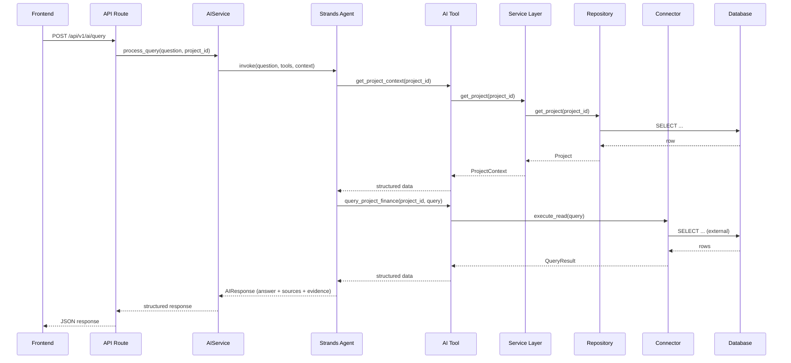
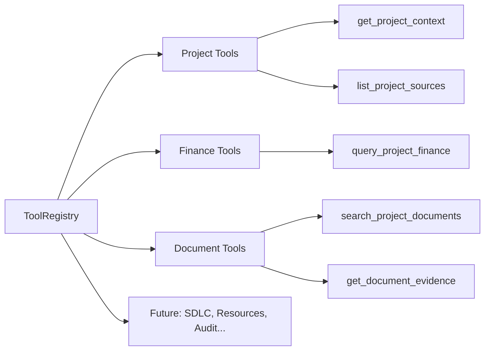
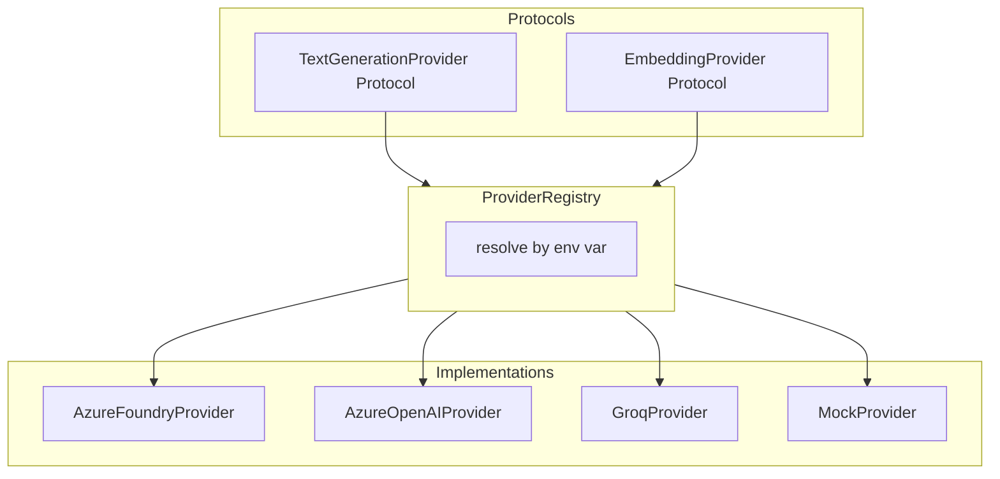

# AI Architecture

## Overview

The AI layer uses Strands as the orchestration framework. The agent answers natural-language questions by invoking domain-scoped tools that retrieve data through the service and connector layers. The agent never has direct database access.

## Full AI Flow



## Component Breakdown

### AIService (`backend/app/ai/service.py`)

Entry point for all AI queries. Responsibilities:
- Assigns `query_id` for traceability
- Resolves project context
- Invokes the Strands agent with appropriate tools
- Captures trace information
- Returns structured `AIResponse`

### Agent (`backend/app/ai/agent.py`)

Strands agent configuration:
- Receives the user question and project context
- Selects and invokes tools based on the question
- Synthesizes tool results into a coherent answer
- Returns structured response with source attribution

### Tool Registry (`backend/app/ai/tools/registry.py`)



Tools are registered by domain and resolved at query time. Each tool:
- Has a single responsibility
- Is independently testable
- Delegates to services/connectors (never accesses DB directly)
- Returns structured data, not formatted text

### Domain-Scoped Tools (`backend/app/ai/tools/`)

| Module | Tools | Data Source |
|--------|-------|-------------|
| `project_tools.py` | `get_project_context`, `list_project_sources` | App_DB via repository |
| `finance_tools.py` | `query_project_finance` | External PG via connector |
| Future: `jira_tools.py` | `query_project_jira` | External source |
| Future: `document_tools.py` | `search_project_documents`, `get_document_evidence` | RAG_DB |

### Prompt Management (`backend/app/ai/prompt_manager.py`)

- Prompts stored as versioned markdown files in `backend/app/ai/prompts/`
- Current: `system_prompt_v1.md`
- `PromptManager` loads and resolves prompts by name and version
- Response metadata records which prompt version produced an answer

### Provider Layer (`backend/app/ai/providers/`)



- Provider selected via `LLM_PROVIDER` / `EMBEDDING_PROVIDER` env vars
- `MockProvider` used in Demo Mode for deterministic responses
- Provider-specific logic (SDK calls, auth) confined to implementation modules
- No provider-specific imports in services or API layers

## Response Contract

Every AI response conforms to a structured schema:

```json
{
  "query_id": "uuid",
  "conversation_id": "uuid",
  "answer": "string",
  "response_type": "text | table | chart",
  "sources": [
    { "source_id": "uuid", "source_label": "Finance PostgreSQL", "source_type": "postgresql" }
  ],
  "evidence": [
    { "claim": "...", "source_id": "uuid", "record": {...} }
  ],
  "visualization_spec": { "type": "bar", "title": "...", "data": [...] },
  "processing_trace": {
    "tools_invoked": ["get_project_context", "query_project_finance"],
    "duration_ms": 1234,
    "provider": "azure_openai",
    "prompt_version": "v1"
  }
}
```

**Rules:**
- No HTML/JSX in responses — frontend renders from structured specs
- Sources use meaningful labels, not internal function names
- Partial results preserved when some tools fail
- Missing data acknowledged honestly rather than hallucinated

## Traceability

Every query is traceable through:
1. `query_id` — unique per query, propagated through all layers
2. `conversation_id` — groups related queries
3. Structured logs with `query_id`, `tool_name`, `source_id`, `duration`
4. Processing trace in the response (tools invoked, provider used, prompt version)

## Security Boundaries

- Agent never receives credentials in prompts or tool configs
- All external queries go through read-only connectors
- Credentials not exposed in AI responses or trace data
- Tool results are structured data, not raw connection details
