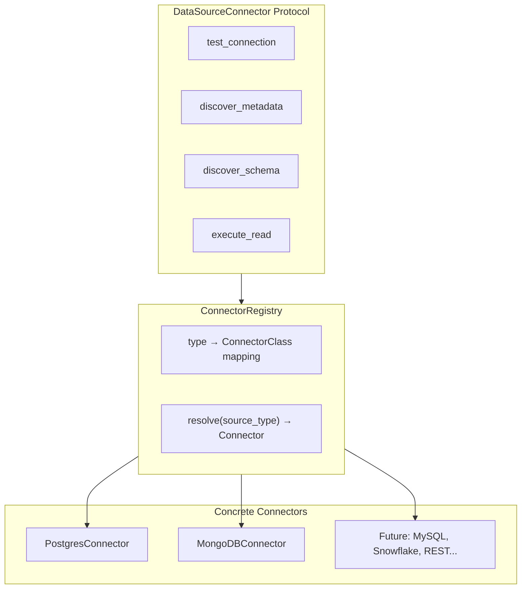
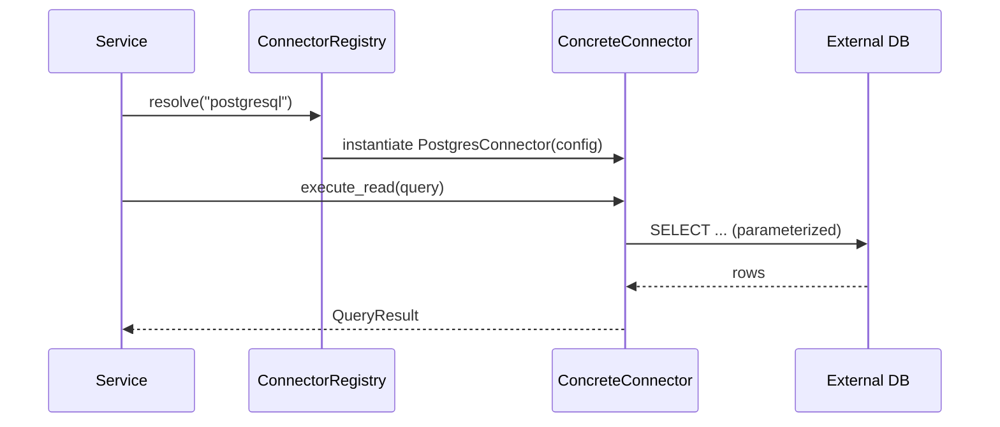

# Connector Architecture

## Overview

Connectors provide read-only access to external structured data sources. The architecture uses a **protocol → registry → concrete connector** pattern that allows new source types to be added without modifying existing code.

## Design Pattern



## Protocol Definition

All connectors implement the `DataSourceConnector` protocol defined in `backend/app/connectors/protocol.py`:

```python
class DataSourceConnector(Protocol):
    async def test_connection(self) -> bool: ...
    async def discover_metadata(self) -> SourceMetadata: ...
    async def discover_schema(self) -> Schema: ...
    async def execute_read(self, query: SourceQuery) -> QueryResult: ...
```

**Key design decisions:**
- `execute_read` accepts a `SourceQuery` type that is source-appropriate — SQL for PostgreSQL, MongoDB-native queries for MongoDB
- Connectors are NOT forced into identical query semantics
- All operations are read-only by default (SELECT-only for SQL, find/aggregate for MongoDB)
- Connection timeout defaults to 10 seconds, configurable per source

## Registry Pattern

The `ConnectorRegistry` in `backend/app/connectors/registry.py` maps source types to implementations:



**Registration:** Connectors register themselves in the registry at application startup. Adding a new connector requires:
1. Implement the `DataSourceConnector` protocol
2. Register the new type in the registry

No existing connector code, AI tools, or business services need modification.

## Concrete Connectors

### PostgresConnector

- Location: `backend/app/connectors/postgres_connector.py`
- Query format: SQL SELECT statements (parameterized)
- Library: asyncpg
- Access: Read-only (SELECT only)

### MongoDBConnector

- Location: `backend/app/connectors/mongodb_connector.py`
- Query format: MongoDB-native find/aggregate operations
- Library: motor (async MongoDB driver)
- Access: Read-only (find, aggregate)

## Error Handling

Connectors raise domain-specific errors defined in the errors module:

| Error Type | When Raised |
|------------|-------------|
| `DataSourceConnectionError` | Connection fails or times out |
| `SchemaDiscoveryError` | Schema introspection fails |
| `QueryExecutionError` | Query fails during execution |
| `UnsupportedDataSourceError` | Requested type not in registry |

Each error includes: source identifier, source type, operation attempted, and the underlying error message.

## Adding a New Connector

1. Create `backend/app/connectors/{source_type}_connector.py`
2. Implement all methods from `DataSourceConnector` protocol
3. Register in `ConnectorRegistry` with the source type key
4. Add domain-specific error handling for the new source
5. No changes needed to existing connectors, services, or AI tools

## Security Constraints

- External databases accessed with SELECT-only credentials
- Connection credentials stored in App_DB per data source, never in code
- Credentials never passed to AI agent or logged
- Parameterized queries only — no string interpolation of user input
