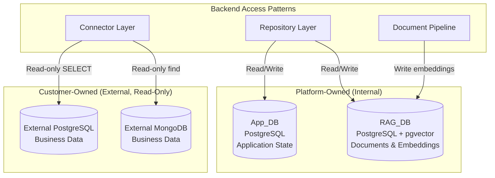
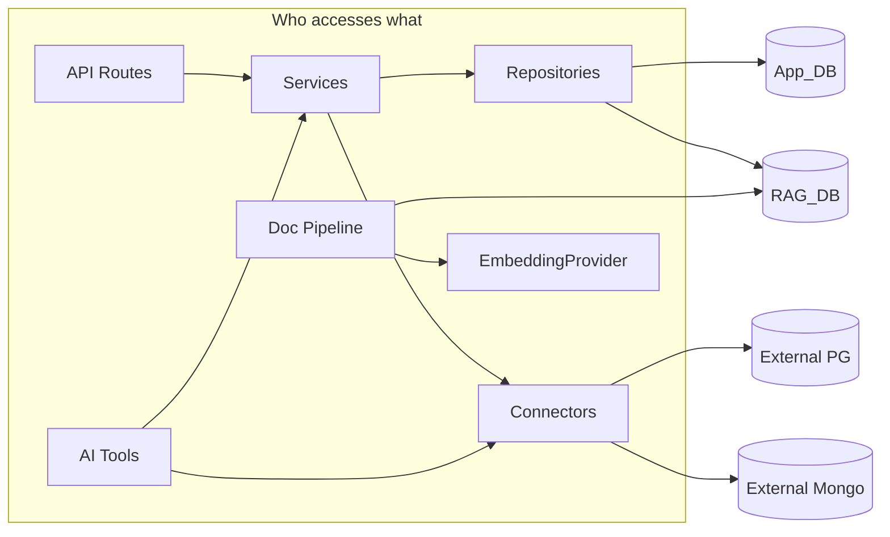

# Database Architecture

## Overview

The platform uses four distinct databases with clearly separated responsibilities. Two are **internal** (owned and managed by the platform), and two are **external** (customer-owned, accessed read-only through connectors).

## Database Topology

## Internal Databases

### App_DB — Application State

Managed via Alembic migrations (`backend/alembic/`). Stores all platform operational data.

**Key entities:**
- `projects` — primary business context
- `data_sources` — connection configurations for external sources
- `project_data_sources` — many-to-many project↔source relationship
- `conversations`, `messages` — AI chat history
- `query_history` — AI query audit trail
- `uploaded_files` — file metadata for ingested documents
- `audit_logs` — system activity tracking

**Conventions:**
- UUIDs for all primary keys
- `created_at` / `updated_at` timestamps on all tables
- `snake_case` table and column names

### RAG_DB — Documents & Embeddings

Managed via Alembic migrations (`backend/alembic_rag/`). Requires the `pgvector` extension.

**Key entities:**
- `documents` — ingested file metadata (project_id, file_name, processing_status)
- `document_chunks` — text segments with positional metadata (page_number, section, chunk_index)
- `embeddings` — vector representations, dimension configurable via `EMBEDDING_DIMENSION` env var

**Design decisions:**
- Separate database allows RAG_DB to evolve independently (schema, indexes, vacuum policies)
- Vector dimension validated at startup against `EMBEDDING_DIMENSION` configuration
- Document chunks retain enough metadata to show evidence origin in the UI

## External Databases

External databases are **never modified** by the platform. Access is strictly read-only.

| Source Type | Connector | Query Format | Access Pattern |
|-------------|-----------|--------------|----------------|
| PostgreSQL  | `PostgresConnector` | SQL SELECT | Parameterized queries via asyncpg |
| MongoDB     | `MongoDBConnector` | MongoDB-native find/aggregate | PyMongo read-only client |

External databases are registered as "Data Sources" in App_DB and associated with projects. The AI agent queries them through tools that delegate to the connector layer.

## Access Layer Boundaries

**Rules:**
- Only repositories access App_DB and RAG_DB
- Only connectors access external databases
- The document pipeline writes to RAG_DB through the repository layer
- AI tools never hold database credentials — they call services/connectors

## Migration Strategy

| Database | Tool | Location | Approach |
|----------|------|----------|----------|
| App_DB | Alembic | `backend/alembic/versions/` | Sequential versioned migrations, reversible |
| RAG_DB | Alembic | `backend/alembic_rag/versions/` | Sequential versioned migrations, reversible |
| External PG | N/A | Customer-managed | Read-only access, no migrations |
| External Mongo | N/A | Customer-managed | Read-only access, no migrations |

**Seed data:** Deterministic seed scripts in `database/seeds/` populate demo data. Seeds are idempotent — running them multiple times produces the same state.

## Configuration

| Variable | Purpose |
|----------|---------|
| `DATABASE_URL` | App_DB connection string |
| `RAG_DATABASE_URL` | RAG_DB connection string |
| `EMBEDDING_DIMENSION` | Vector column dimension (must match model output) |
| External source credentials | Stored per data-source in App_DB, resolved at query time |
