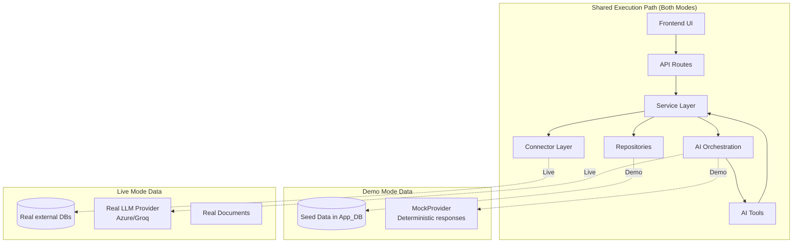
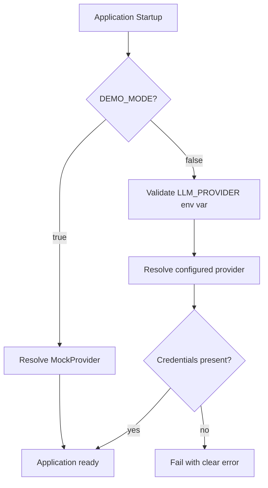

# Demo Mode vs Live Mode Architecture

## Overview

The platform supports two operational modes — Demo and Live — configured via the `DEMO_MODE` environment variable. Both modes use the **same execution path**: same API routes, same services, same AI orchestration, same frontend components. The difference is in data sources and provider behavior, not in code paths.

## Same Execution Path, Different Data

## How It Works

### Demo Mode (`DEMO_MODE=true`)

1. **Data:** App_DB and RAG_DB pre-populated with deterministic seed data
2. **LLM Provider:** `MockProvider` returns controlled, repeatable responses
3. **External sources:** Seed data simulates external source results (no real external connections required)
4. **Behavior:** Identical API calls produce identical results across restarts

### Live Mode (`DEMO_MODE=false`)

1. **Data:** Real projects and configurations in App_DB
2. **LLM Provider:** Configured provider (Azure AI Foundry, Azure OpenAI, or Groq)
3. **External sources:** Real PostgreSQL/MongoDB connections through connectors
4. **Documents:** Real file ingestion through the document pipeline
5. **Validation:** All required provider credentials and source configurations must be present at startup

## What Is NOT Different Between Modes

| Component | Same in both modes? |
|-----------|-------------------|
| API endpoint paths | ✓ |
| Request/response schemas | ✓ |
| Service layer logic | ✓ |
| AI tool invocation flow | ✓ |
| Response contract structure | ✓ |
| Frontend components | ✓ |
| Source/evidence rendering | ✓ |
| Error handling paths | ✓ |

There are no demo-only components, demo-only API endpoints, or hard-coded AI responses outside of the seed data infrastructure.

## Configuration Switch

Switching between modes requires only:
1. Set `DEMO_MODE=true` or `DEMO_MODE=false` in `.env`
2. Restart the application

No source code changes, no rebuild, no redeployment.

## Provider Resolution

In Demo Mode, the `MockProvider` is used regardless of what `LLM_PROVIDER` is set to. This ensures demos work without real API keys.

In Live Mode, the configured provider must have all required credentials available or the application refuses to start.

## Conditional Validation

The startup validation differs by mode:

| Validation | Demo Mode | Live Mode |
|-----------|-----------|-----------|
| App_DB connection | Required | Required |
| RAG_DB connection | Required | Required |
| LLM provider credentials | Not required | Required |
| Embedding provider credentials | Not required | Required |
| External source credentials | Not required | Required per source |
| Seed data presence | Expected | Not required |

## Transitioning from Demo to Live

The architecture supports a smooth transition during a client walkthrough:

1. Start in Demo Mode — show pre-configured scenarios
2. Stop the application
3. Set `DEMO_MODE=false`, configure real provider keys and source credentials
4. Restart — same UI, same flows, now with real data
5. Connect a real data source, test connection, discover schema
6. Ask an AI question against real data
7. Inspect sources and evidence — same rendering, real content

This transition requires zero frontend changes and zero code modifications.
