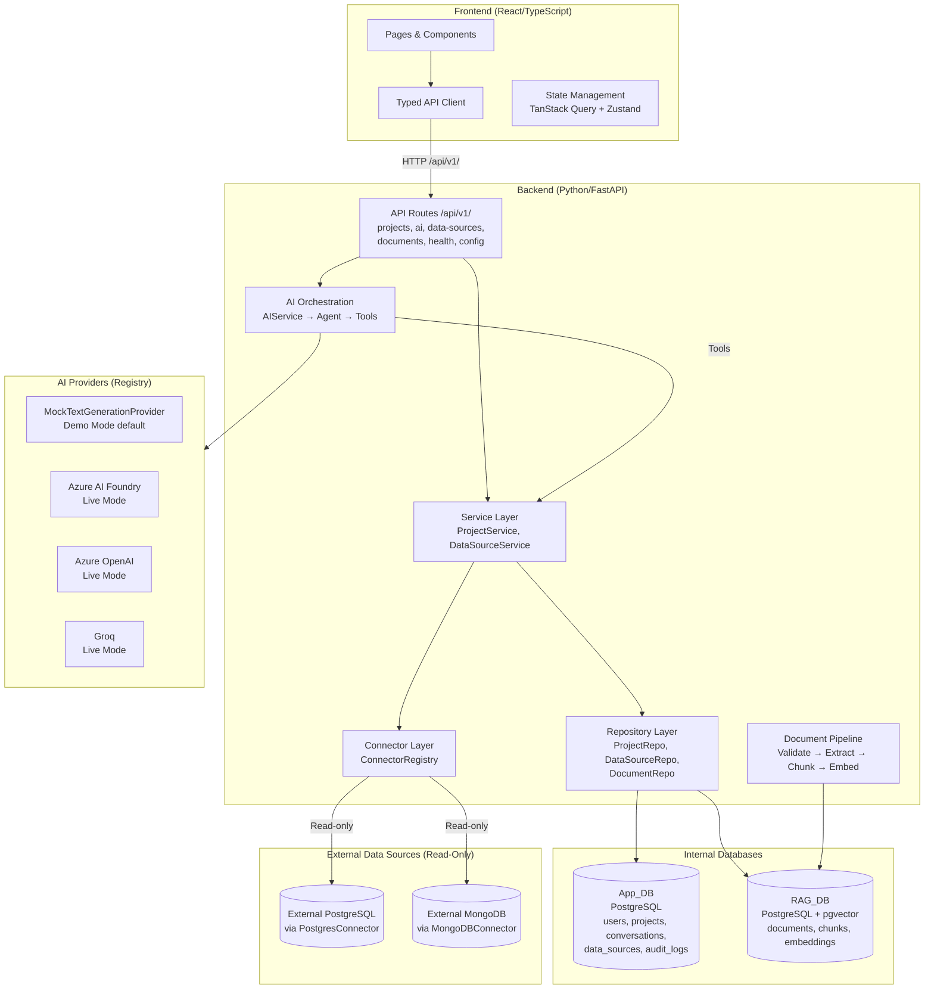
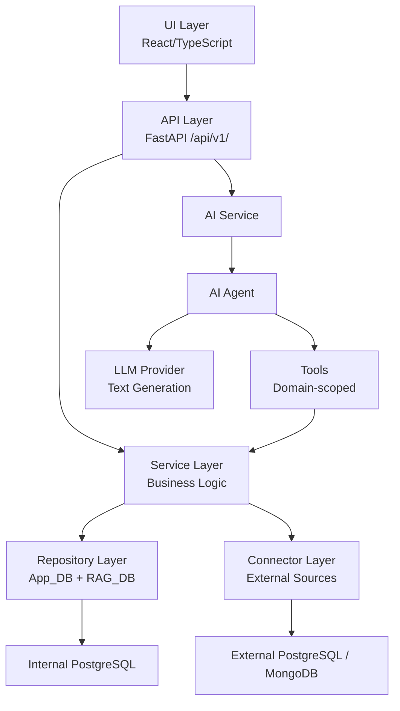

# System Architecture Overview

> **Last verified:** Phase 0, Checkpoint C — full integration verified (309 tests passing, frontend builds cleanly)

## Platform Summary

Technology Transformation Intelligence is a modular monolith providing AI-powered project intelligence. The platform connects to external data sources, ingests documents, and uses an AI agent to answer natural-language questions with full source attribution.

## High-Level Architecture (Verified)



## Dependency Flow

Strict layered architecture — dependencies flow downward only:



## AI Query Flow (Verified End-to-End)

```
POST /api/v1/ai/query
    → AIService.execute_query(question, project_id, query_id, conversation_id)
        → AIAgent.invoke(question, project_id, query_id)
            → ToolRegistry.get_tool("get_project_context")
                → ProjectService.get_project(project_id)
                    → ProjectRepository → App_DB
            → ToolRegistry.get_tool("query_project_finance")
                → DataSourceService → DataSourceRepository → App_DB
            → TextGenerationProvider.generate(prompt, system_prompt)
        → AIResponse { answer, response_type, sources, evidence, query_id, is_partial }
```

## Demo Mode vs Live Mode

Both modes follow the **identical execution path** (see [ADR-006](../decisions/ADR-006-demo-mode-architecture.md)):

| Aspect | Demo Mode | Live Mode |
|--------|-----------|-----------|
| LLM Provider | MockTextGenerationProvider (deterministic) | Azure AI Foundry / OpenAI / Groq |
| Embedding Provider | MockEmbeddingProvider (seeded PRNG vectors) | Azure OpenAI / Foundry |
| Data Sources | Seeded App_DB + RAG_DB | Real databases + external connections |
| Startup Validation | Skipped for credentials | Fails fast on missing config |
| Code Path | Same API → Service → Repository → DB | Same API → Service → Repository → DB |

## Key Architectural Principles

1. **Layered separation** — API routes are thin; business logic lives in services; data access lives in repositories
2. **Dependency injection** — all dependencies assembled at composition root (`dependencies.py`), enabling testability
3. **Registry pattern** — ConnectorRegistry and ProviderRegistry enable adding implementations without modifying existing code
4. **AI tool isolation** — the agent accesses data only through registered tools; never receives credentials (see [ADR-007](../decisions/ADR-007-strands-tool-architecture.md))
5. **Demo/Live parity** — same execution path in both modes, differing only in data and provider configuration
6. **Configuration-driven** — all environment-specific values loaded from environment variables via Pydantic Settings
7. **Partial failure resilience** — AI responses preserve successful tool data when some tools fail; `is_partial` flag and `failed_sources` inform the consumer

## Module Layout (Verified)

```text
backend/
├── app/
│   ├── api/v1/          # Route handlers (thin) — projects, ai, data-sources, documents, health, config
│   ├── config/          # Settings (Pydantic), structured logging (structlog)
│   ├── models/          # SQLAlchemy ORM entities
│   ├── schemas/         # Pydantic request/response DTOs
│   ├── repositories/    # Database access (App_DB + RAG_DB)
│   ├── services/        # Business logic (ProjectService, DataSourceService)
│   ├── connectors/      # External data source access (PostgresConnector, MongoDBConnector, Registry)
│   ├── ai/
│   │   ├── providers/   # TextGenerationProvider + EmbeddingProvider protocols and implementations
│   │   ├── tools/       # Domain-scoped tools (project_tools, finance_tools) + ToolRegistry
│   │   ├── prompts/     # System prompt templates (versioned .md files)
│   │   ├── service.py   # AIService orchestrator
│   │   ├── agent.py     # AIAgent (Phase 0 simplified; Phase 1: full Strands)
│   │   ├── response.py  # AIResponse builder + markup stripping
│   │   └── trace.py     # QueryTrace with credential sanitization
│   ├── documents/       # Ingestion pipeline (validate, extract, chunk, embed)
│   ├── errors/          # Domain error types + HTTP status mapping
│   ├── middleware/       # Request ID (UUID v4 ContextVar)
│   └── utils/           # Focused utilities
├── alembic/             # App_DB migrations (Alembic)
├── alembic_rag/         # RAG_DB migrations (Alembic, pgvector)
└── tests/               # Unit tests (309 passing)

frontend/
├── src/
│   ├── app/             # Shell, router, providers
│   ├── pages/           # Route-level components
│   ├── features/        # Self-contained domain features
│   ├── components/      # Shared UI + shadcn/ui base components
│   ├── services/        # Typed API client (single HTTP entry point)
│   ├── hooks/           # Custom hooks
│   ├── stores/          # Global state (Zustand)
│   ├── config/          # Environment, feature flags, API URL
│   ├── types/           # Shared TypeScript types
│   └── constants/       # Application constants

docs/
├── architecture/        # Architecture documentation (this file)
├── decisions/           # ADRs (001–007)
└── setup/               # Development setup guides
```

## Integration Points (Verified at Checkpoint C)

| Endpoint | Proves | Status |
|----------|--------|--------|
| `GET /api/v1/health` | Backend starts, middleware works | ✓ |
| `GET /api/v1/projects/{id}` | API → Service → Repository → App_DB | ✓ |
| `POST /api/v1/ai/query` | Full AI orchestration: API → AIService → Agent → Tools → Service → DB → Provider | ✓ |
| `POST /api/v1/data-sources/{id}/test-connection` | ConnectorRegistry resolution, connector invocation | ✓ |
| `POST /api/v1/documents/upload` | Document pipeline entry point reachable | ✓ |

## Related Documentation

- [ADR-006: Demo Mode Architecture](../decisions/ADR-006-demo-mode-architecture.md)
- [ADR-007: Strands Tool Architecture](../decisions/ADR-007-strands-tool-architecture.md)
- [ADR-008: Project Primary Context](../decisions/ADR-008-project-primary-context.md)
- [ADR-009: Document Ingestion Pipeline](../decisions/ADR-009-document-ingestion-pipeline.md)
- [Local Development Setup](../setup/local-development.md)
